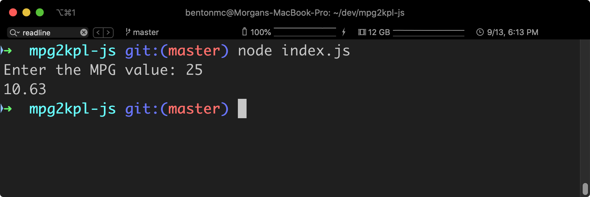

# MPG to KPL Converter in JS

A MPG to KPL converter in JavaScript

Here is a screenshot of my working program:

## Thoughts

The hardest part about this project was figuring out how to get user input from the command line. I'd never used the `readline` package before. The documentation was relatively straightforward, but it assumed that I had some experience with Node (which I didn't have before this) and that made it more difficult.
